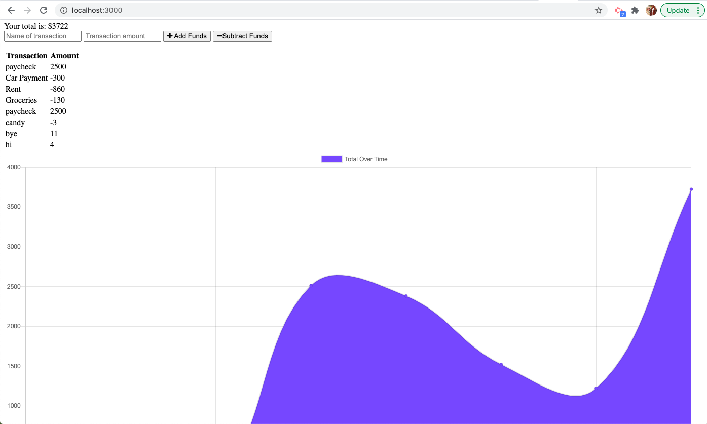

# budget-tracker

## Description 
This budger tracker is a progressive web application that allows users to track their budgets by adding funds and subtracting expenses by using the "Add/Subtract Funds" buttons. They are able to add a transaction with or without internet connection. When a user enters a transaction while offline, they will be stored in the indexedDB, and will be transferred to the database when the user is back online.

## Table of Contents
- Installation 
- usage 
- Example
- Contributors

## Installation
To install the required dependencies, run "npm install" in the terminal.

## Usage
To start the server, run "npm start" in the terminal. to access the app after starting the server, navigate to http://localhost:3000/ in the browser

## Example
Deployed Application:

Example Screenshot: 

## Contributors

This application was created by Caroline Phillips!!